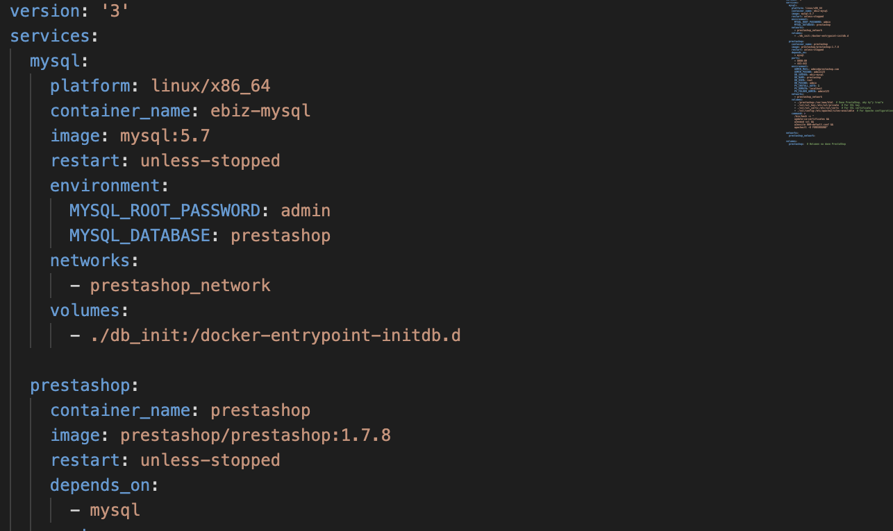

# BE PROJECT

Project for Electronical Busines - course at 5th semester of Computer Science at Gdansk University of Technology. The main goal was to create a mock-up online store as close to original as possible using prestashop, docker, and mysql. 


## Authors
[@Henryk Wołek](https://github.com/wolekhenryk)
[@Zuzanna Nowak](https://github.com/zuzqqa)
[@Adam Chabraszewski](https://github.com/achabrasz)
[@Agata Domasik](https://github.com/agatadomasik)

##How to run our project locally?

Firstly, install docker (Linux) or Docker Engine (Windows/MacOS).

In case of running the project on Windows, you need to install WSL as well.

Next, clone the project.

```bash
  git clone https://github.com/wolekhenryk/bizneselektroncizny
```

Go to project's directory.

```bash
  cd bizneselektroniczny
```
Run the project by composing docker containers

```bash
  docker compose up -d
```

If something doesn't work, firstly check if docker engine is up and running (Windows/MacOS).
Secondly, give the proper permissions to the whole project by running.

```bash
  sudo chmod -R 777
```

Project is accessible at: 
[https://localhost:8080](https://localhost:8080) for Prestashop main page
[https://localhost:8080/admin123](https://localhost:8080/admin123) for admin panel

## Tech-stack
- prestashop v1.7.8-apache
- mysql
- docker
- python
- selenium
- prestapyt

## FAQ

#### What are credentials to myadmin panel?

Email: admin@prestashop.com
Password: admin123

### Project is not starting on Unix (Linux/MacOS) system

Insert line "platform: linux/x86_64" under msql section



### What scripts can I run?

* bizneselektroniczny/scripts/main.py
  * Script intended to load/delete products

* bizneselektroniczny/ssl/generate_new_certificates.sh
  * Script meant to regenerate ssl certificates
  * Run by executing:
```bash
  cd bizneselektroniczny/ssl
  ./generate_new_certificates.sh
```

* bizneselektroniczny/db_dump.sh
  * Script meant to save changes done to prestashop configuration (do it before committing changes)
  * Run by executing:
```bash
  ./db_dump.sh
```

* Scraper
  * Code meant to scrap products data from a target webiste
  * Open project solution in Visual Studio and run Program.cs
 
* Selenium Tests: bizneselektroniczny/test/selenium.py
  * Script meant to test functionalities of our shop
  * Firstly install selenium
    
  ```powershell
    pip install prestapyt
  ```
  * Then, run the python script
